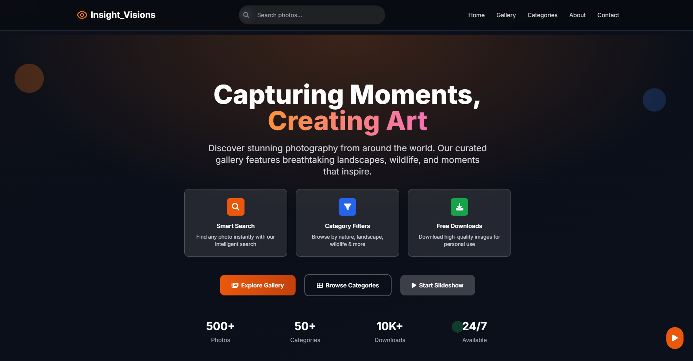

# 📸 DevXVisions Gallery

## 🌟 Project Description

DevXVisions Gallery is a modern, responsive photo gallery website that showcases stunning photography from around the world. Built entirely with vanilla web technologies, this front-end project demonstrates clean code practices and modern web design principles. The gallery features an intuitive interface for browsing, filtering, and viewing high-quality images across various categories including landscapes, nature, wildlife, and water scenes.

## 📷 Screenshot


*Main gallery interface showcasing the responsive grid layout and modern design*

## ✨ Key Features

- 📱 **Fully Responsive Design** - Optimized for mobile, tablet, and desktop viewing
- 🖼️ **Interactive Image Modal** - Lightbox functionality for full-size image viewing
- 🎨 **Modern UI/UX** - Clean design with smooth animations and hover effects
- 🔍 **Smart Search Functionality** - Search images by title, description, or category
- 🏷️ **Category Filtering** - Filter images by landscape, nature, wildlife, and water
- 🎬 **Slideshow Mode** - Automatic slideshow with play/pause controls
- ❤️ **Interactive Elements** - Like, share, and download functionality
- 🌙 **Dark Theme** - Modern dark interface with gradient accents
- ⚡ **Lazy Loading** - Performance optimized with lazy loading images
- 🔄 **Infinite Scroll** - Dynamic content loading for seamless browsing
- ⌨️ **Keyboard Navigation** - Full keyboard support for accessibility
- 📱 **Mobile-First Approach** - Touch-friendly interface for mobile devices

## 🛠️ Technologies Used

- **HTML5** - Semantic markup and modern web standards
- **CSS3** - Advanced styling with Flexbox, Grid, and custom animations
- **Vanilla JavaScript (ES6+)** - Modern JavaScript features and DOM manipulation
- **Font Awesome** - Icon library for UI elements
- **Google Fonts** - Inter font family for typography
- **Tailwind CSS** - Utility-first CSS framework for rapid styling

## 🚀 Getting Started

Follow these simple steps to run the project locally:

### Prerequisites
- A modern web browser (Chrome, Firefox, Safari, Edge)
- Git installed on your machine

### Installation

1. **Clone the repository**
   ```bash
   git clone https://github.com/IleshDevX/devxvisions-gallery.git
   ```

2. **Navigate to the project directory**
   ```bash
   cd devxvisions-gallery
   ```

3. **Open the project**
   Simply open the `index.html` file in your preferred web browser:
   ```bash
   # On macOS
   open index.html
   
   # On Windows
   start index.html
   
   # On Linux
   xdg-open index.html
   ```

That's it! The gallery should now be running in your browser.

## 📁 Project Structure

```
devxvisions-gallery/
├── index.html          # Main HTML file
├── style.css           # Custom CSS styles
├── main.js            # JavaScript functionality
├── images/            # Gallery images directory
└── README.md          # Project documentation
```

## 🎯 Features Overview

### Gallery Functionality
- **Grid Layout**: Responsive masonry-style grid that adapts to different screen sizes
- **Image Modal**: Click any image to open it in a full-screen lightbox with navigation
- **Category System**: Organize images by type (Landscape, Nature, Wildlife, Water)
- **Search**: Real-time search functionality across titles, descriptions, and categories

### User Interactions
- **Like System**: Interactive heart button with like counter
- **Share Feature**: Native web share API with clipboard fallback
- **Download**: Direct image download functionality
- **Slideshow**: Automated slideshow with manual controls

### Performance & UX
- **Lazy Loading**: Images load only when needed to improve performance
- **Smooth Animations**: CSS transitions and transforms for polished interactions
- **Mobile Optimized**: Touch gestures and mobile-friendly interface
- **Keyboard Accessible**: Full keyboard navigation support

## 🌐 Browser Support

- Chrome (latest)
- Firefox (latest)
- Safari (latest)
- Edge (latest)

## 📧 Contact

**Ilesh Patel** - Full-Stack Developer & Data Analyst

[](https://github.com/IleshDevX)
[](https://www.linkedin.com/in/ilesh-patel-968942270/)
[](mailto:ileshpatel666@gmail.com)

---

<div align="center">
  <p>⭐ Star this repository if you found it helpful!</p>
  <p>Made with ❤️ and vanilla JavaScript</p>
  <p>Made by IleshdevX </p>
</div>
